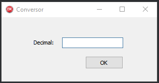

# Simple Decimal to Roman Number Converter

## 🔸 About : 
Converter made in a work environment for learning the language described below :

## 🔨 Tools:
- Delphi 10.3

## ✅ Accomplished requirements:
- Validate the entries informed by the user, allow to enter only numbers

- Validate that the number entered is in the range between 1 and 1000, if it is not informing the user through a message

- Use one or more classes to perform conversions

- All procedures must be done in the created classes, the design must only invoke the created methods, informing the necessary parameters according to what was typed by the user
